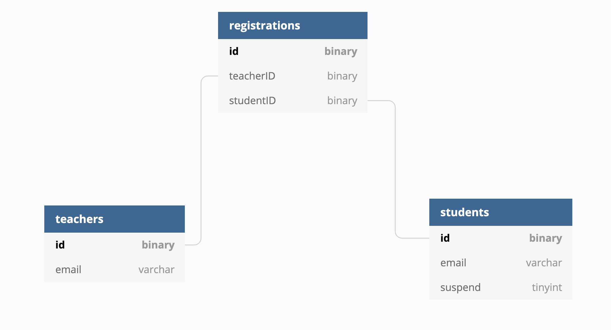

# GovTech NodeJS API Asessment


Develop a set of API endpoints for teachers to perform administrative functions for their classes.

## Content
- [Content](#content)
- [Introduction](#introduction)
- [Public API link](#public-api-link)
- [Getting Started](#getting-started)
  - [Running Locally](#running-locally)
  - [Testing Locally](#testing-locally)
- [Extra Info](#extra-info)
  - [API](#api)
  - [Project](#project)
  - [MySQL](#mysql)

## Introduction

This is an asessment from GovTech, more details in https://gist.github.com/d3hiring/4d1415d445033d316c36a56f0953f4ef

## Public API link

Here is the link https://8o4zbsskqi.execute-api.ap-southeast-1.amazonaws.com
You may test the APIs without running locally by using the link above.

## Getting Started

Start by cloning the repository and installing dependencies.

```bash
# Clone the repository
git clone https://github.com/MonkeyD-IchiJou/govtech-nodejs-api.git

# Go inside the directory
cd govtech-nodejs-api/

# Install dependencies
npm install
```

### Running Locally

Make sure you have Node.js version >= `14.13.1` and npm version >= `6.14.8`

Please get the `.env` file from the main developer, copy and paste the `.env` file to the project top level directory (.e.g. ./govtech-nodejs-api/.env). This is a very important step before running locally. The `.env` contains the credentials to connect to mysql database. 

After you have meet all the requirements in your local machine, you may run

```bash
npm start
```

And it will listen at `localhost:3000`

### Testing Locally
```bash
# unit testing
npm run test

# integration testing with the public API link https://8o4zbsskqi.execute-api.ap-southeast-1.amazonaws.com
npm run test:integration
```

## Extra Info

### API

All APIs descriptions and example is here https://documenter.getpostman.com/view/1166674/TVzUDFzY

### Project

All the codes is in `src` folder. And the API implementation codes are in `src/api` folder. Typescript is the main programming language in this project.

### MySQL


Behind the scenes in mysql tables, I have 3 tables to store the necessary data about each student, teacher, and their registration relationship, instead of 1 giant table.


